# Язык написания контрактов: LawScript!

[](https://deepwiki.com/B-E-R-K-Y-T/LawScript)

## Сырой запуск:


### Windows
```
py -m venv .venv 
.venv/Scripts/activate
set PYTHONPATH=%CD%
pip install -r requirements.txt
py law.py --run hello_world.raw
```

### Linux/Mac

#### ВАЖНО! На маке могут потребоваться "танцы с бубном!"

```
py -m venv .venv 
.venv/Scripts/activate
export PYTHONPATH=$(pwd)
pip install -r requirements.txt
py law.py --run hello_world.raw
```

## Сборка:

```
pyinstaller --onefile --add-data="src;src" --hidden-import=requests .\law.py
```

### Запуск exe

```
law.exe --run hello_world.raw
```

Если Вы увидете такой вывод: 


Значит LawScript работает штатно!

### Конфигурация

Для настройки LawScript создайте файл law_config.env

### Философия языка

Данный язык совмещает в себе две философии: Декларативную и Императивную


## Пример императивного кода

1


2


3


## Пример декларативного кода


## Пример обработки ошибок

----
Язык понимает, что вы имели в виду, даже когда вы ошибаетесь!
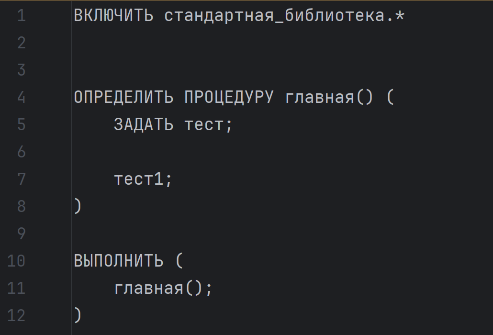
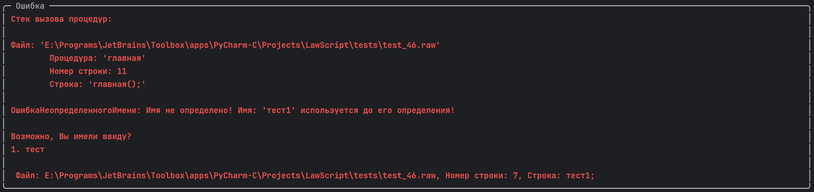

----
Не переданные аргументы
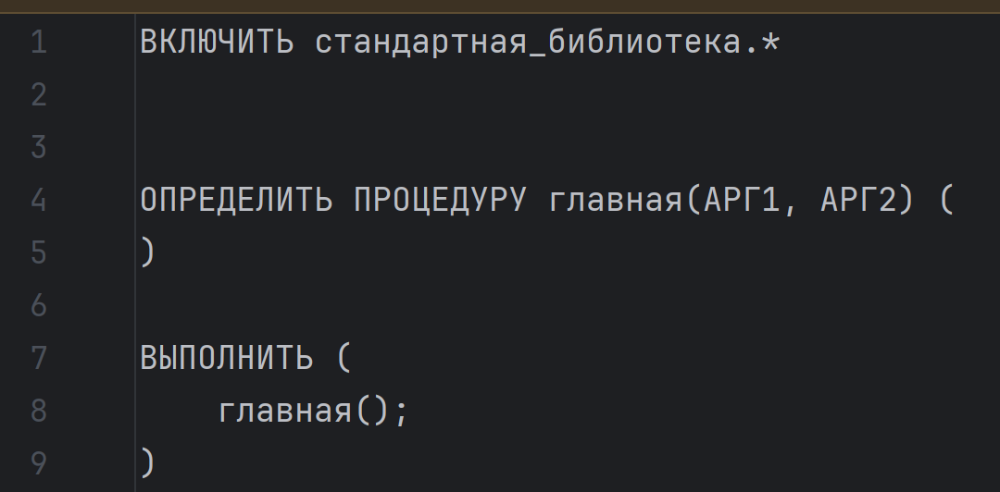
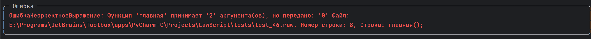

----
Одинаковые аргументы
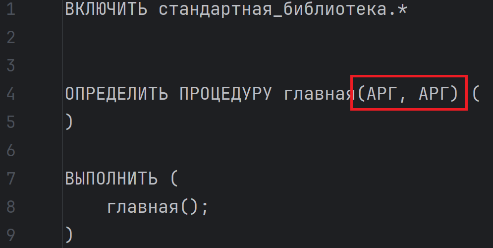
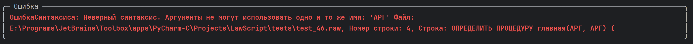

----
Двойное ожидание фоновой задачи
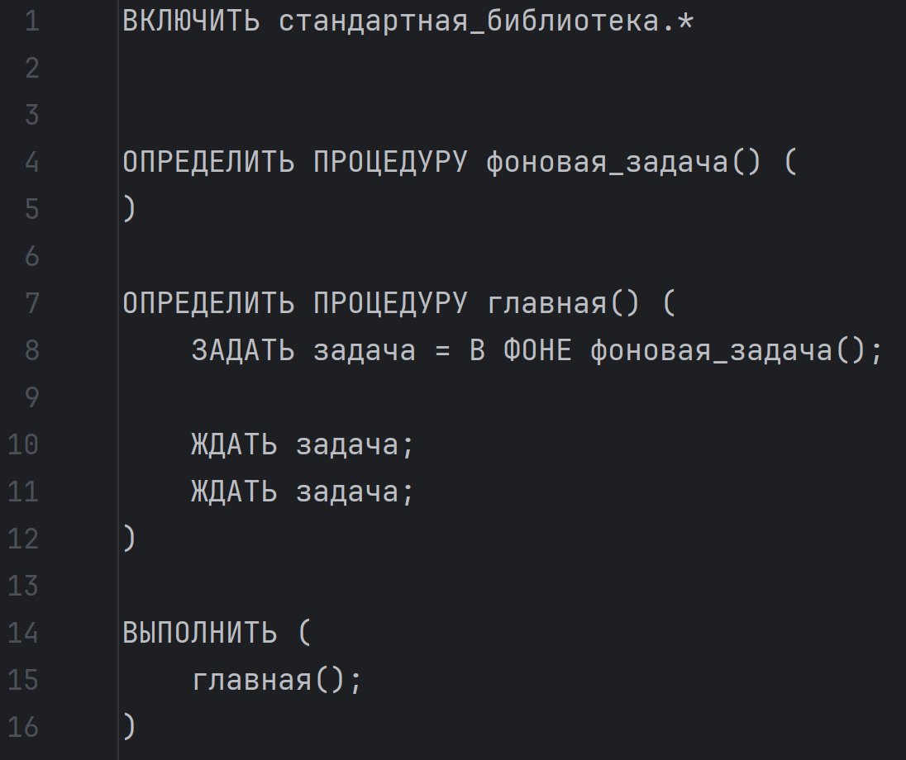
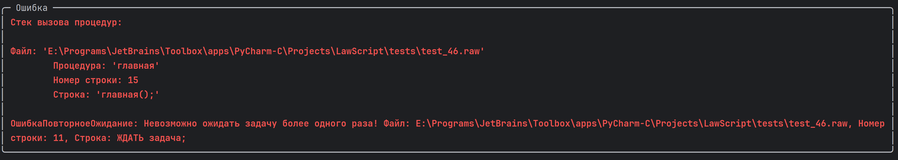

----
Хорошо понимает контекст ошибки. Показывает конкретное выражение
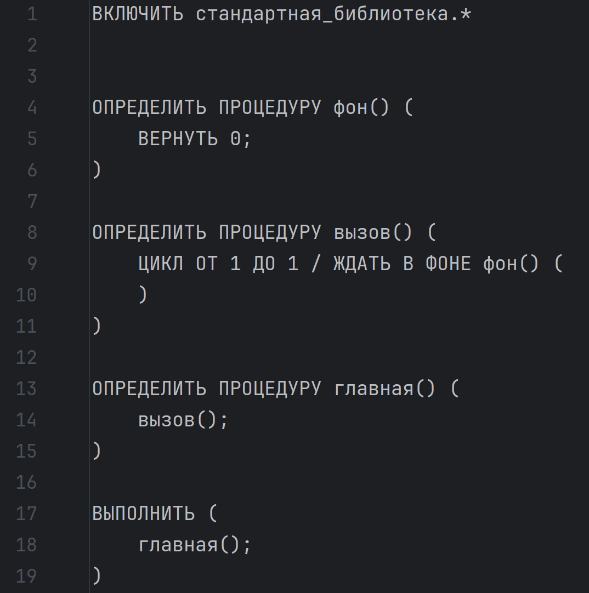
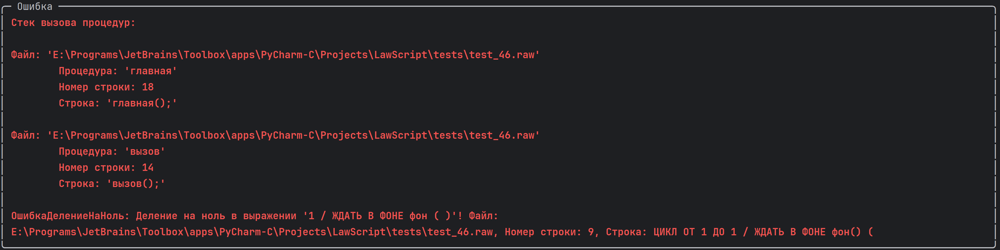

----
В рамках выражений, тоже хорошо понимает, что сломалось
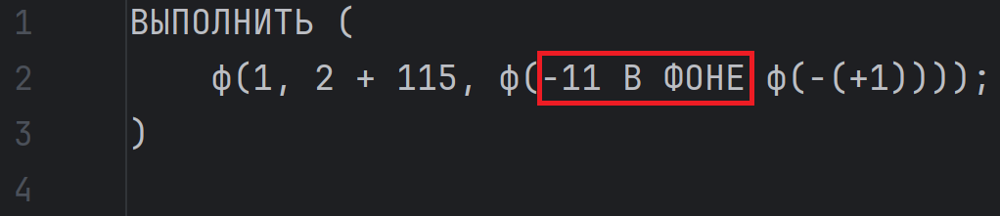
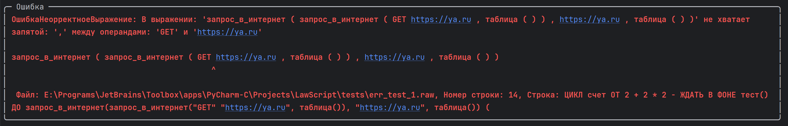